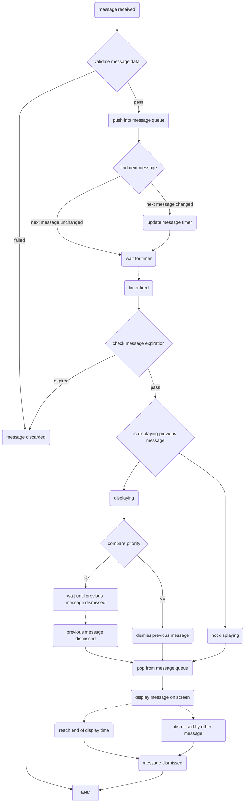

# WPToastManager
系统推送通知风格的消息弹窗
- 支持自定义样式
- 支持频控管理
- 支持屏幕旋转

## 流程图



## 核心类
- WPToastCenter: MVC中的C，控制消息展示等
- WPToastMessage: 消息数据对象，实现同名协议方法
- WPAbstractToast: 消息UI的抽象基类，不直接使用，自定义样式可以继承该类配合WPToastMessage的customToastClass使用
- WPEventToast: 默认消息UI,样式类似系统推送，
- WPToastWindow: 用于展示消息的独立 window，跟随keyWindow处理屏幕旋转
- WPToastControlInfo: 频控规则。WPToastCenter内部通过WPToastMessage的type字段匹配频到一个具体的规则，决定展示的顺序/间隔/消息是否过期等

## 示例
``` swift
    // 添加频控规则 - 实际项目中可以通过网络请求从后台获取频控规则
    let info = WPToastControlInfo()
    info.type = "debug"
    info.interval = 3
    info.expiration = 10
    info.priority = 1
    
    let info1 = WPToastControlInfo()
    info1.type = "debug1"
    info1.interval = 1
    info1.expiration = 10
    info1.priority = 10
    
    let info2 = WPToastControlInfo()
    info2.type = "debug2"
    info2.interval = 0
    info2.expiration = 10
    info2.priority = 20
    
    WPToastCenter.shared.loadControlInfo([info, info1, info2])
    WPToastCenter.shared.delegate = self;

    // 展示消息
    let message = WPToastMessage()
    message.title = "title"
    message.subtitle = "subtitle"
    message.displayTime = 5.0
    message.imageURL = "https://bpic.588ku.com/element_origin_min_pic/00/92/57/9856f2293341d6f.jpg"
    WPToastCenter.shared.push(message)
```

## Example

To run the example project, clone the repo, and run `pod install` from the Example directory first.

## Author

weiping.lii@icloud.com

## License

WPToastManager is available under the MIT license. See the LICENSE file for more info.
